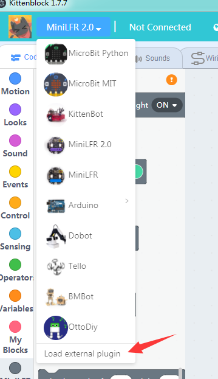

# Extensions for kittenblock

Here are all the existing extensions for kittenblock, you may modify or use in any purpose. All code based on scratch3.0 standards for now, some interface may changes if MIT Team changes their codebase.

We will release a devtool very soon to create a scaffold of your own extension, it should also compatible with scratch3 or any scratch3 based tools.

Please read the develop guide first [Kittenblock插件开发指南](http://learn.kittenbot.cn/zh_CN/latest/kittenblock/%E6%8F%92%E4%BB%B6%E5%BC%80%E5%8F%91%E6%8C%87%E5%8D%97.html)

## How to load extension

1. Please get kittenblock V1.77 or above, you may find the link here [http://kittenbot.cn/#/software](http://kittenbot.cn/#/software). *Sorry for that our English site is still under constructing:)*

2. Load an external extension js sourcecode 

## Things to notice

To load an extension file please change formateMessage define from

`const formatMessage = require('format-message');` to

`const formatMessage = Scratch.formatMessage;`.

As the format-message-cli need it for auto generate multilanguage JSON files.

## Bug or Feature Request

Please feel free to fire an issue if you find any bugs or wants new API or access.
